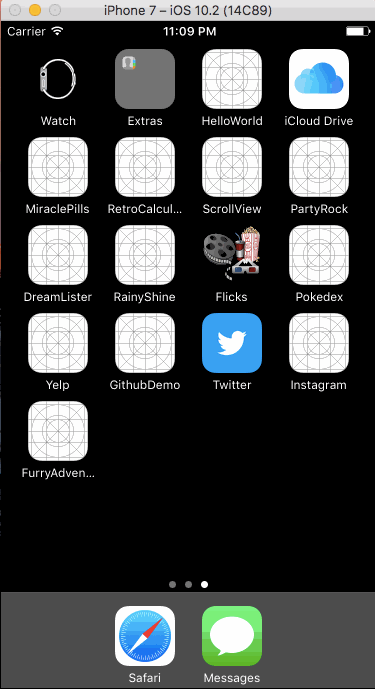

# Furry Adventure

A recipe by ingredients app. (WIP)

## User Stories

##### REQUIRED

- [X] Launch Screen and App Icon
- [X] User will be able to list ingredients they have, and will receive a list  of foods they can make with only their ingredients
- [X] The user can tab over to a new page of recipes that contain their ingredients and others they do not possess 
- [ ] User can use a settings menu to filter recipes by allergies

##### OPTIONAL

- [ ] User can search for nearby grocery store for missing ingredients
- [ ] User can order online for groceries to be delivered to their house for recipes
- [ ] Recipes will have calorie counts 
- [ ] User will be able to filter recipes by calories

## Video Walkthrough

Here's a walkthrough of implemented user stories:

## Wireframes

**Initial views**

**Ingredient adding interfaces**

**Cart and recipe search views**

**Recipe view**

**Data Scheme**

Session
* ID

Ingredient
* ID
* SessionID
* Units
* Name
* Quantity

API
* YummlyID
* EdamamID
* SpoonID

Recipe
* YummlyID
* SessionID
* Name
* EdamamID
* SpoonID

Req Ingredient
* IngredientID
* Recipe Quantity
* YummlyID
* EdamamID
* SpoonID

## APIs
* Yummly
* Edemam
* Spoonacular

## License

    Copyright 2017 Hung Do, Robert Mitchell, Sang Saephan, Edwin Young

    Licensed under the Apache License, Version 2.0 (the "License");
    you may not use this file except in compliance with the License.
    You may obtain a copy of the License at

        http://www.apache.org/licenses/LICENSE-2.0

    Unless required by applicable law or agreed to in writing, software
    distributed under the License is distributed on an "AS IS" BASIS,
    WITHOUT WARRANTIES OR CONDITIONS OF ANY KIND, either express or implied.
    See the License for the specific language governing permissions and
    limitations under the License.
